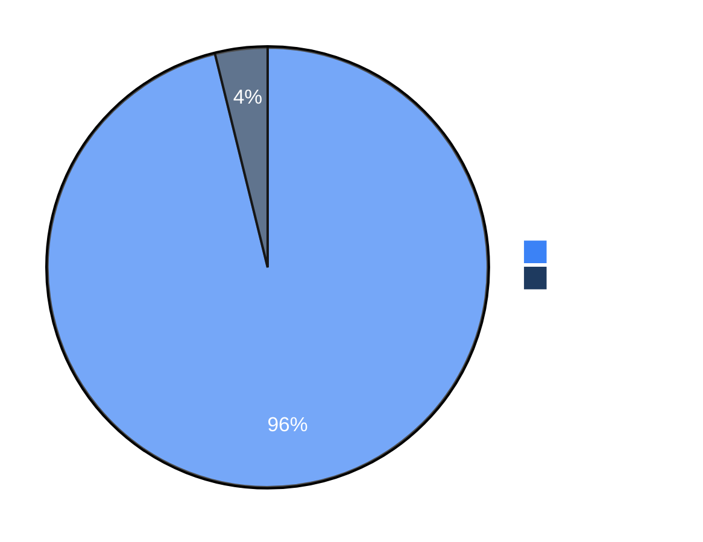

# 基准测试

我们使用安全基准测试持续跟踪 Strix 的能力边界与演进效果。后续还会加入更多现有基准，以及我们自建的评测集，帮助社区更客观地评估和比较安全代理。

## 完整数据

完整的基准结果、评测脚本与运行数据请查看 [usestrix/benchmarks](https://github.com/usestrix/benchmarks) 仓库。

> [!NOTE]
> 我们正在持续扩展评测套件，后续会补充更多基准。

## 结果

| 基准 | 挑战数量 | 成功率 |
|------|----------|--------|
| [XBEN](https://github.com/usestrix/benchmarks/tree/main/XBEN) | 104 | **96%** |

### XBEN

[XBOW benchmark](https://github.com/usestrix/benchmarks/tree/main/XBEN) 包含 104 个 Web 安全挑战，用于评估自治渗透测试代理的表现。每个挑战都采用 CTF 形式，要求代理自主发现并利用漏洞，最终提取隐藏的 flag。

Strix `v0.4.0` 在黑盒模式下达到了 **96% 成功率**（104 个挑战中完成 100 个）。

**按难度划分的表现：**

| 难度 | 完成数 | 成功率 |
|------|--------|--------|
| Level 1（简单） | 45/45 | 100% |
| Level 2（中等） | 49/51 | 96% |
| Level 3（困难） | 6/8 | 75% |

**资源消耗：**
- 平均解题时间：约 19 分钟
- 总成本：100 个挑战约 `$337`
